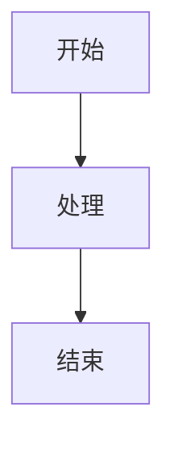

# Mermaid 图表支持 — 设计规格

**日期**: 2026-06-20
**状态**: 设计完成，待实现

---

## 1. 概述

为 zdown Markdown 编辑器添加 Mermaid 图表渲染支持。用户在 Markdown 中使用 fenced code block 标记语言为 `mermaid`，编辑器将在预览、HTML 导出和 PDF 导出中渲染为 SVG 图表。

```markdown

```

---

## 2. 方案选择

采用 **mermaid.ink 云端渲染**（方案 A）：

- 将 Mermaid 语法编码为 URL，通过 HTTP GET 请求 `https://mermaid.ink/img/pako:<encoded>` 获取 SVG
- 零额外运行时依赖，仅需 HTTP 客户端（已有 ureq）
- 纯 SVG 输出，适合所有渲染目标

---

## 3. 架构

### 3.1 新增 crate

`crates/mermaid_renderer/`

```
crates/mermaid_renderer/
├── Cargo.toml
└── src/
    ├── lib.rs      ← MermaidRenderer struct, is_mermaid()
    ├── encode.rs   ← pako deflate + base64url 编码
    └── cache.rs    ← SHA256 内容寻址 + LRU 缓存
```

### 3.2 核心接口

```rust
pub struct MermaidRenderer {
    cache: LruCache<String, String>,
    timeout: Duration,
}

impl MermaidRenderer {
    pub fn new() -> Self;
    pub fn render(&mut self, source: &str) -> Result<String>;  // → SVG
    pub fn is_mermaid(cb: &CodeBlock) -> bool;
}
```

### 3.3 URL 编码

使用 pako deflate（`flate2` 实现）+ base64url 编码：

1. Mermaid 源码 → UTF-8 字节
2. deflate 压缩（`flate2::Compression::best()`）
3. base64url 编码（`base64::engine::general_purpose::URL_SAFE`）
4. 构造 URL：`https://mermaid.ink/img/pako:<encoded>`

---

## 4. 各视图/导出集成

### 4.1 egui 预览（markdown_renderer）

**文件**: `crates/markdown_renderer/src/render.rs`
**函数**: `render_code_block()`

检测 `cb.language == Some("mermaid")` 时：
1. 调用 `MermaidRenderer::render()` 获取 SVG
2. 使用 `resvg` + `tiny-skia` 将 SVG 光栅化为 `egui::ColorImage`
3. 渲染为 `egui::Image`

**新增依赖**: `resvg = "0.42"`, `tiny-skia = "0.11"`

### 4.2 HTML 导出（export_engine）

**文件**: `crates/export_engine/src/html.rs`
**函数**: `render_code_block()`

检测到 mermaid 时：
1. 调用 `MermaidRenderer::render()` 获取 SVG
2. 输出 `" />`

### 4.3 PDF 导出（export_engine）

**文件**: `crates/export_engine/src/renderer.rs`
**函数**: `render_code_block()`

检测到 mermaid 时：
1. 调用 `MermaidRenderer::render()` 获取 SVG（或使用缓存的 SVG）
2. 使用 `resvg` 光栅化为像素
3. 通过 `genpdf::elements::Image` 嵌入 PDF

### 4.4 源码视图

**不变** — 源码模式显示原始 Mermaid 文本。

---

## 5. 错误处理

采用多层降级策略：

| 场景 | 行为 |
|------|------|
| 网络请求成功 | 渲染 SVG 图表 |
| 网络超时（10s） | 降级为语法高亮代码块 |
| Mermaid 语法错误 | 在图表位置显示错误摘要文字 |
| 无网络 | 降级 + 如有缓存命中则使用缓存 |
| SVG/光栅化失败 | 降级为语法高亮代码块 |

降级后不阻塞文档其他部分的正常渲染。

---

## 6. 缓存策略

- **内容寻址**: 对 Mermaid 源码做 SHA256 哈希作为缓存键
- **LRU 淘汰**: 上限 50 条，超出后淘汰最少使用的条目
- **会话内有效**: 不持久化到磁盘
- **作用**: 避免同一图表在同一文档中多次出现时重复请求

---

## 7. 依赖汇总

| 依赖 | 用途 | 状态 |
|------|------|------|
| `ureq` | HTTP GET mermaid.ink | 已有 |
| `base64` (0.22) | base64url 编码 | 已有 |
| `flate2` | pako deflate 压缩 | 🆕 |
| `resvg` (0.42) | SVG 光栅化（egui/PDF） | 🆕 |
| `tiny-skia` (0.11) | resvg 的光栅后端 | 🆕 |
| `lru` | LRU 缓存容器 | 🆕 |
| `sha2` | SHA256 哈希（用于缓存键） | 🆕 |

---

## 8. 测试计划

### 8.1 单元测试

- `encode` 模块：URL 编码正确性（编码/解码往返）
- `cache` 模块：LRU 插入/淘汰/查找
- `is_mermaid`：识别 language="mermaid" 和不匹配的 language

### 8.2 集成测试

- `render`：有效 Mermaid 语法返回 SVG 字符串
- `render`：无效语法返回错误（不 panic）
- `render`：网络不可用时返回错误（不 panic）

### 8.3 渲染测试

- 预览模式：Mermaid 代码块渲染为 egui Image（非文本）
- HTML 导出：SVG 正确内嵌在 HTML 中
- PDF 导出：图表嵌入 PDF 页面

---

## 9. 变更影响范围

| 影响 | 文件 |
|------|------|
| 🆕 新增 | `crates/mermaid_renderer/` (整个 crate) |
| ✏️ 修改 | `crates/markdown_renderer/src/render.rs` (render_code_block) |
| ✏️ 修改 | `crates/export_engine/src/html.rs` (render_code_block) |
| ✏️ 修改 | `crates/export_engine/src/renderer.rs` (render_code_block) |
| ✏️ 修改 | `Cargo.toml` (workspace members + 新依赖) |
| ✅ 不变 | 源码视图、编辑逻辑、AST 解析 |
